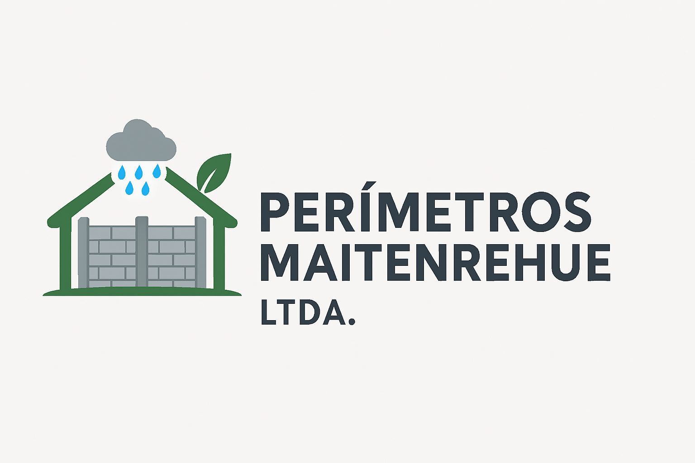

# CercoVibrados del Sur - Aplicación Web



Aplicación web oficial de **CercoVibrados del Sur**, una fábrica familiar dedicada a la producción de cercos vibrados de alta calidad en el sur de Chile. La plataforma ofrece una experiencia de usuario intuitiva y moderna, permitiendo a los clientes cotizar productos y a los administradores gestionar el inventario de manera eficiente.

## ✨ Features

- **Catálogo de Productos y Cotizaciones:** Los usuarios pueden explorar los productos y solicitar cotizaciones personalizadas a través de un formulario interactivo.
- **Panel de Administración Seguro:** Interfaz de administración protegida para la gestión de cotizaciones e inventario.
- **Gestión de Inventario (Bodega):** Los administradores pueden agregar, editar, eliminar y buscar productos, con un sistema de badges de colores para visualizar el stock.
- **Seguridad Robusta:**
    - **Autenticación con JWT:** Uso de JSON Web Tokens para proteger las rutas del panel de administración.
    - **Hashing de Contraseñas:** Las contraseñas se almacenan de forma segura utilizando `bcrypt`.
    - **Middleware de Seguridad:** Implementación de `helmet` para proteger la aplicación de vulnerabilidades conocidas y `express-rate-limit` para prevenir ataques de fuerza bruta.
- **Optimización y Rendimiento:**
    - **Imágenes Optimizadas:** Uso de imágenes en formato `.webp` para una carga más rápida.
    - **Componentes Virtualizados (a futuro):** Se puede implementar para mejorar el rendimiento en listas largas de productos o cotizaciones.
- **Diseño Responsivo:** La interfaz está diseñada para ser completamente funcional y estéticamente agradable tanto en dispositivos de escritorio como móviles.

## 📄 Páginas

### Página Principal (Pública)

- **Inicio:** Una sección de bienvenida con una imagen destacada.
- **Galería de Productos:** Muestra los diferentes tipos de cercos y trabajos realizados.
- **Cotización:** Un formulario donde los clientes pueden solicitar cotizaciones personalizadas, con una imagen de referencia que cambia dinámicamente según la altura del cerco seleccionada.

### Panel de Administración (Privado)

- **Login:** Formulario de acceso seguro para administradores.
- **Dashboard de Cotizaciones:** Visualización de todas las cotizaciones enviadas por los clientes.
- **Gestión de Bodega:** Una interfaz moderna e intuitiva para la administración del inventario de productos.

## 🛠️ Tecnologías Utilizadas

### Frontend

- **React:** Biblioteca de JavaScript para construir la interfaz de usuario.
- **React Bootstrap:** Componentes de UI pre-construidos y responsivos.
- **React Router DOM:** Para la navegación y el enrutamiento del lado del cliente.
- **React Bootstrap Icons:** Colección de iconos SVG.
- **Framer Motion:** Para animaciones fluidas y transiciones.

### Backend (Server)

- **Node.js & Express:** Para construir el servidor y la API REST.
- **JSON Web Token (JWT):** Para la autenticación y autorización.
- **bcrypt:** Para el hashing seguro de contraseñas.
- **Helmet:** Middleware de seguridad para Express.
- **Express Rate Limit:** Para limitar las peticiones repetidas a la API.
- **CORS:** Para habilitar el acceso controlado a recursos desde diferentes dominios.

## 🚀 Getting Started

Sigue estos pasos para configurar y ejecutar el proyecto en tu máquina local.

### Prerrequisitos

- [Node.js](https://nodejs.org/) (versión 14 o superior)
- [npm](https://www.npmjs.com/)

### Instalación

1.  **Clona el repositorio desde GitHub:**
    ```bash
    git clone https://github.com/Lagger-craft/PerimetrosMaitenrehue.git
    ```

2.  **Navega al directorio del proyecto:**
    ```bash
    cd PerimetrosMaitenrehue
    ```

3.  **Instala las dependencias del Frontend:**
    ```bash
    npm install
    ```

4.  **Instala las dependencias del Backend:**
    ```bash
    cd server
    npm install
    cd ..
    ```

### Ejecución

La aplicación consta de dos partes: el cliente (React) y el servidor (Express). Debes ejecutar ambos para que la aplicación funcione correctamente.

1.  **Inicia el servidor backend:**
    Desde el directorio raíz del proyecto, ejecuta:
    ```bash
    npm run start-server
    ```
    El servidor se iniciará en `http://localhost:5000`.

2.  **Inicia el cliente frontend:**
    En una nueva terminal, desde el directorio raíz del proyecto, ejecuta:
    ```bash
    npm start
    ```
    La aplicación se abrirá en tu navegador en `http://localhost:3000`.

## 📁 Estructura del Proyecto

```
cercovibrados-web/
├── server/               # Backend (Express)
│   ├── node_modules/
│   ├── package.json
│   └── server.js         # Lógica del servidor
├── src/                  # Frontend (React)
│   ├── assets/           # Imágenes y otros recursos
│   ├── components/       # Componentes de React
│   │   ├── admin/        # Componentes del panel de administración
│   │   └── auth/         # Componentes de autenticación
│   ├── context/          # Contexto de React (ej. AuthContext)
│   ├── App.js            # Componente principal y enrutador
│   └── index.js          # Punto de entrada de la aplicación
├── package.json          # Dependencias y scripts del frontend
└── README.md             # Este archivo
```

## 🤝 Contribuciones

Las contribuciones son bienvenidas. Si deseas mejorar el proyecto, por favor sigue estos pasos:

1.  Haz un Fork del repositorio.
2.  Crea una nueva rama (`git checkout -b feature/nueva-funcionalidad`).
3.  Realiza tus cambios y haz commit (`git commit -m 'Agrega nueva funcionalidad'`).
4.  Haz push a la rama (`git push origin feature/nueva-funcionalidad`).
5.  Abre un Pull Request.

---
*Este README fue generado y actualizado para proporcionar una guía completa y fácil de entender para futuros desarrolladores.*